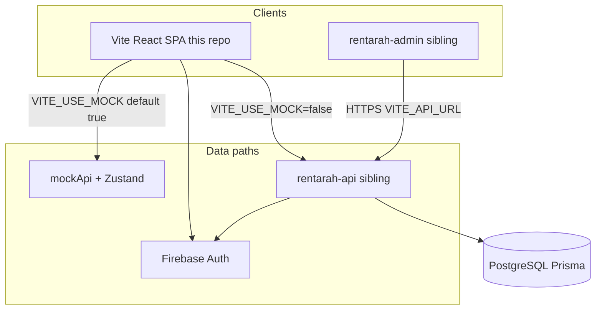

# RentaraH — Frontend architecture

Living document for the Vite React SPA. API contracts and PostgreSQL modeling live in sibling docs:

- [API_AND_DATA_REQUIREMENTS.md](./API_AND_DATA_REQUIREMENTS.md)
- [DATA_MODEL_AND_ARCHITECTURE.md](./DATA_MODEL_AND_ARCHITECTURE.md)
- [API_IMPLEMENTATION_BACKLOG.md](./API_IMPLEMENTATION_BACKLOG.md)
- [ENVIRONMENTS.md](./ENVIRONMENTS.md)
- [CHANGELOG.md](./CHANGELOG.md)
- [repository-separation.md](./repository-separation.md)
- [SEPARATION_REPORT.md](./SEPARATION_REPORT.md)

---

## System topology



Three **independent repositories** (not a monorepo):

| Repo | Path (typical sibling) | Role |
|------|------------------------|------|
| Web | `rentahub2026.github.io` | Customer SPA (this repo) |
| API | `rentarah-api` | Express + Prisma + Firebase Admin |
| Admin | `rentarah-admin` | Ops UI → API only (no DB) |

---

## Layering

```
Presentation (features/*/components, pages, app layout)
    ↓
Application (services, feature hooks)
    ↓
Domain (types, pure utils: pricing, availability, search)
    ↓
Infrastructure (repositories, apiClient, mockApi, firebase)
```

**Rules:**

- UI must not import `firebase/*` or `apiClient` directly — use hooks/services.
- Repositories implement swappable adapters (mock ↔ REST) behind `VITE_USE_MOCK`.
- Zustand holds client/UI state; TanStack Query holds server state.

---

## Folder structure

```
src/
  app/                 # App shell, router, providers, queryClient
  features/            # Feature slices (auth, browse, booking, catalog, host, map, messaging, trust, landing)
  components/
    ui/                # Shared MUI composition wrappers (EmptyState, …)
    layout/            # Shell chrome + TrustGate
  services/            # Application use-cases
  repositories/        # HTTP / mock adapters
  hooks/               # Cross-feature hooks (e.g. useVehicles)
  lib/                 # firebase, stripe, env helpers
  utils/
  config/              # DEFAULT_SEARCH_FILTERS, …
  types/
  assets/
  tests/               # Shared test setup
  store/               # Zustand (client/UI; catalog persist limited in prod)
```

Path alias: `@/` → `src/` (Vite + TypeScript).

Compatibility re-exports remain under `src/pages/` and former `src/components/{auth,browse,…}` paths for one release cycle.

---

## Migration status

| Area | Status | Notes |
|------|--------|-------|
| Path alias `@/` | Done | Vite + tsconfig |
| Vitest smoke | Done | `npm test` |
| `docs/architecture.md` | Done | This file |
| `src/app/` shell | Done | App + Query providers |
| `src/repositories/` | Done | Vehicle/Booking interfaces + mock/HTTP |
| Dead code removal | Done | Unused landing/map/browse pieces |
| Shared UI / SearchResultsShell | Done | Phase 2 |
| Feature folder moves | Done | Phase 4 — shims at old paths |
| TanStack Query | Done | `useVehicles` + catalog merge |
| Performance | Done | Lazy landing listings; card `sizes`/`srcSet` |
| Security locks | Done | Local auth gate, ID approve defaults, admin unlock |
| Unit tests | Done | Search, trust, booking auth flag |
| E2E (Playwright) | Scaffolded | Install `@playwright/test` to run `e2e/` |

---

## State management

| Kind | Tool | Examples |
|------|------|----------|
| Server state | TanStack Query | vehicles list (`vehicleQueryKeys`) |
| Client/UI state | Zustand | search filters, snackbar, onboarding, booking draft, map UI, saved IDs |
| Auth session | Zustand + `features/auth/services/authService` | Firebase behind service; local credentials gated |

---

## Routing

Defined in `src/app/App.tsx` (re-exported from `src/App.tsx`). Public routes under `MainLayout`; booking/host/dashboard gated by `ProtectedRoute` + `TrustGate` wrappers.

---

## Security notes (SPA)

- Local credential auth (`btoa`) gated by `VITE_ALLOW_LOCAL_AUTH` (dev default on, production example off).
- Trust/ID/host gates remain client-side until the API enforces authz.
- `VITE_ID_VERIFICATION_INSTANT_APPROVE` — production builds default to manual review when unset.
- Admin SPA requires `VITE_ADMIN_UNLOCK=true`; replace with Firebase admin claims before public deploy.
- Booking HTTP adapter sends `Authorization: Bearer` when not mocking.

See [API_IMPLEMENTATION_BACKLOG.md](./API_IMPLEMENTATION_BACKLOG.md) for server-side work.

---

## Testing

| Command | Purpose |
|---------|---------|
| `npm test` | Vitest unit/component tests |
| `npm run test:watch` | Vitest watch mode |
| `npm run typecheck` | `tsc --noEmit` |
| `npm run lint` | ESLint |
| Playwright | `e2e/` + `playwright.config.ts` (optional install) |

---

## Migration principles

1. Preserve routes, styling, and behavior.
2. One feature (or vertical slice) per PR going forward.
3. Prefer `git mv` to preserve history.
4. Re-export shims from old paths for at most one release cycle.
5. Explain architectural decisions in the PR body.
